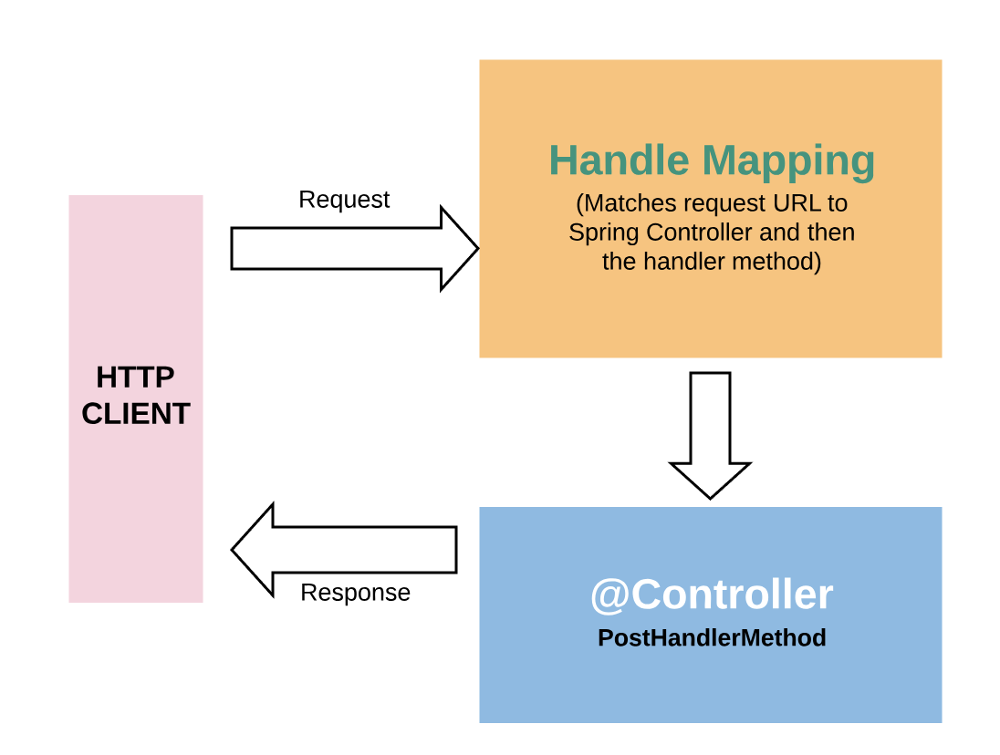
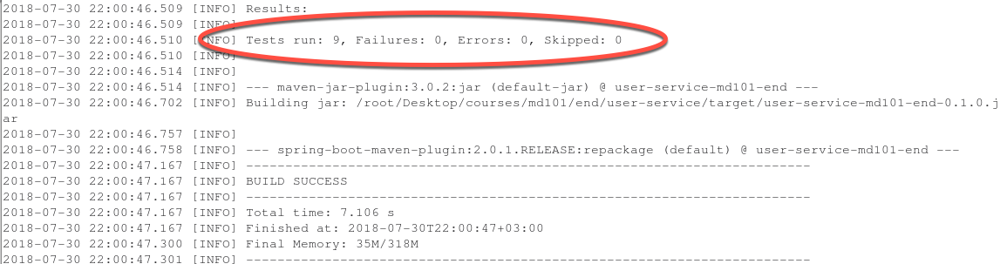

# MD101 - Step 5: Creating New Users

Currently, your **user-service** application has functionality for retrieving users with a GET method. But right now there's no way to add a new user to the system (other than hard-coding one in your `UserService` class).

In this step, you will get an introduction to the POST method in the context of REST. When you are finished with this step, you will be able to create new users in your service using HTTP and REST calls.

_**Need to go back to the previous step?** In the Terminal, enter `git checkout step_4` and then refresh your browser._

---

## Creating Data With POST

While the GET method lets you retrieve information from a resource, the POST method lets you create _new_ resources. Unlike GET requests, POST requests are not idempotent and are considered "unsafe". That is, the outcome of a POST request is unpredictable and is not guaranteed to be repeatable without potentially undesirable side effects.

In a RESTful service, the POST method must be used to create the new resource within a _collection_. The body of the POST request contains the suggested state representation of the new resource to be added to the collection on the server.

Typically, the POST method is used to invoke function-oriented resources in a controller. The POST request can include headers and a body as inputs to the resource's function. When the request is sent to the server, the controller intercepts it. The controller is in charge of mapping requests as well as performing any transformation needed for the data being passed. The diagram below illustrates how the controller intercepts and handles POST requests.



### How Does POST Fit Into user-service?

In this step, you will create a new endpoint that uses the POST verb to create new users for your application. When you are done, you'll have an endpoint that looks something like the code block below.

Notice how the `id` field is not passed in the body of the POST request. That's because you want the application assign an ID to users on creation, as opposed to the client specifying one. (You'll be adding a `createUser` method to do this.) The request also passed in every field, as none of them are considered optional. You will be enforcing this through request validation.

```
Request:
HTTP POST /users
{"firstName":"test", "lastName":"name", "middleInitial":"a", "userType":"PATRON", "dateOfBirth":"1-1-1980"}

Response:
201 CREATED
{"id":"2", "firstName":"test", "lastName":"name", "middleInitial":"a", "userType":"PATRON", "dateOfBirth":"1-1-1980"}
```

---

## Implementing POST Into user-service

To implement a POST action into **user-service**, you'll need to do several things:

1. Implement a method in `UserService` that can create users.
2. Create a new POST method in `UserController` that can delegate to the `UserService` class and respond accordingly.
3. Create unit and integration tests to verify your new functionality.

### Start With Your Tests

Now that you know what you need to implement, this is a great time to begin writing some unit and integration tests. You can then modify them as you work through the exercise. As mentioned before, this course does not strictly enforce TDD (test-driven development), but writing tests first is definitely the recommended approach.

Here's what your tests will need to cover:

* **Unit tests**
  * A test to verify creation of users in the `UserService` class
  * A test to verify the controller functionality and the resulting 201 response code

* **Integration tests**
  * A test to verify that you can successfully create a user by way of RESTful HTTP, and then retrieve it after creation

Take a few minutes to start writing your tests now. This will help you to verify that the code you produce is doing what it should do. Regardless of when you choose to write tests, you can see examples of these tests at the end of this README, as well as in the **end** project in STS.

### Modify the UserService

Right now the `UserService` class only has a method for retrieving users. You need to implement a new method that can create users. It should do the following things:

1. Accept as parameters all the details needed to create a user.
2. Generate a unique `id` to assign to the new user.
3. Create the new user and then return it.

#### Add a UserDetails Class

The requirements above present a unique challenge given how the `User` object is currently implemented. It is immutable, and therefore offers no setters for setting a user ID. To get around this, you're going to create a separate class for user details.

Add a class called `UserDetails` in the `org.amdocs.elearning.user.service.user` package within `src/main/java`. Then add the following code to **UserDetails.java**.

```java
package org.amdocs.elearning.user.service.user;

import java.time.LocalDate;

public class UserDetails {

	protected String firstName;
	protected String lastName;
	protected String middleInitial;
	protected UserType userType;
	protected LocalDate dateOfBirth;

	public UserDetails() {
	}

	public UserDetails(String firstName, String lastName, String middleInitial,
			UserType userType, LocalDate dateOfBirth) {
		this.firstName = firstName;
		this.lastName = lastName;
		this.middleInitial = middleInitial;
		this.userType = userType;
		this.dateOfBirth = dateOfBirth;
	}

	public String getFirstName() {
		return firstName;
	}

	public String getLastName() {
		return lastName;
	}

	public String getMiddleInitial() {
		return middleInitial;
	}

	public UserType getUserType() {
		return userType;
	}

	public LocalDate getDateOfBirth() {
		return dateOfBirth;
	}

}
```

#### Refactor the User Class

Now refactor the `User` class by removing the user details and extending it as a subclass of your new `UserDetails` class. Here's how your **User.java** code should look.

```java
package org.amdocs.elearning.user.service.user;

import java.time.LocalDate;

public class User extends UserDetails {

	private String id;

	public User() {

	}

	public User(final String id, final UserDetails details) {
		this.id = id;
		this.firstName = details.getFirstName();
		this.lastName = details.getLastName();
		this.middleInitial = details.getMiddleInitial();
		this.userType = details.getUserType();
		this.dateOfBirth = details.getDateOfBirth();
	}

	public User(String id, String firstName, String lastName, String middleInitial, UserType userType,
			LocalDate dateOfBirth) {
		this.id = id;
		this.firstName = firstName;
		this.lastName = lastName;
		this.middleInitial = middleInitial;
		this.userType = userType;
		this.dateOfBirth = dateOfBirth;
	}

	public String getId() {
		return id;
	}
}
```

#### Add a createUser Method to UserService

There's one last modification to make for this refactor. You need to add a new `createUser` method in `UserService`. Your **UserService.java** should look like the following.

```java
package org.amdocs.elearning.user.service.user;

import java.time.LocalDate;
import java.util.ArrayList;
import java.util.List;
import java.util.Optional;

public class UserService {

	private final List<User> users = new ArrayList<>();

	public UserService() {
		users.add(new User("0", "Smith", "Joe", "B", UserType.PATRON, LocalDate.parse("1980-01-01")));
		users.add(new User("1", "Green", "Anne", "A", UserType.VENUE_OWNER, LocalDate.parse("1983-02-09")));
	}

	public Optional<User> getUserById(final String id) {
		return users.stream().filter(user -> user.getId().equals(id)).findFirst();
	}

	public User createUser(final UserDetails userDetails) {
		final int newUserId = users.size();
		final User newUser = new User(String.valueOf(newUserId), userDetails);
		users.add(newUser);
		return newUser;
	}

	public List<User> getAllUsers() {
		return users;
	}
}
```

#### What Just Happened?

As always with programming, there are a number of ways you could have approached this refactor. In this case, you split your `User` object into two objects to logically separate a user's details from the user record that contains the ID. Then you added a method to `UserService` that accepts the user details as input, and returns a full-fledged `User` with an `id` as output.

### Modifying the UserController

Now that `UserService` is able to create a user, you can wire up this functionality to `UserController`. To be able to handle a POST request, the controller needs to do the following:

1. Implement a new method marked with the `RequestMethod.POST` request mapping. (You'll need to import the Spring `RequestBody` annotation.)
2. Accept a `UserDetails` object.
3. Delegate to the `createUser` method in `UserService`.
4. On success, return an HTTP 201 (Created) with the newly created user.

Your code for `UserController` should now look something like the following.

```java
package org.amdocs.elearning.user.service.user;

import java.util.Optional;

import org.springframework.beans.factory.annotation.Autowired;
import org.springframework.http.HttpStatus;
import org.springframework.http.ResponseEntity;
import org.springframework.web.bind.annotation.PathVariable;
import org.springframework.web.bind.annotation.RequestBody;
import org.springframework.web.bind.annotation.RequestMapping;
import org.springframework.web.bind.annotation.RequestMethod;
import org.springframework.web.bind.annotation.RestController;

@RestController
@RequestMapping("/users")
public class UserController {

	private final UserService userService;

	@Autowired
	public UserController(final UserService userService) {
		this.userService = userService;
	}

	@RequestMapping(path = "/{id}", method = RequestMethod.GET)
	public ResponseEntity<User> getUser(@PathVariable final String id) {

		final Optional<User> userOptional = this.userService.getUserById(id);

		if (userOptional.isPresent()) {
			return new ResponseEntity<User>(userOptional.get(), HttpStatus.OK);
		}

		return new ResponseEntity<User>(HttpStatus.NOT_FOUND);
	}

	@RequestMapping(method = RequestMethod.POST)
	public ResponseEntity<User> createUser(@RequestBody final UserDetails user) {

		final User createdUser = this.userService.createUser(user);
		return new ResponseEntity<User>(createdUser, HttpStatus.CREATED);
	}

}
```

#### What Just Happened?

Your new method packs a lot into a few lines of code:

* You use `@RequestMapping` and `RequestMethod.POST` to tell Spring to map this method to an HTTP POST to the `/users` endpoint.
* You use `@RequestBody` to tell Spring that you want to accept a request body that's represented by the `UserDetails` object. The request is sent as JSON, and the serialization/deserialization is handled automatically by way of Jackson--a JSON parsing library used by Spring.
- You accept the `UserDetails` object, and delegate creation of the user to `UserService`.
- You return an HTTP 201 on success. HTTP 201 signifies that an entity was created. You also return the newly created user as JSON.

One important thing to notice is that your controller is just acting as a broker here. It facilitates the interaction between the data that is being passed in and the business logic (in this case `UserService`).

### Building and Running

It's time to restart your server and see what you've built! In the Terminal, make sure you're in the **md101/sandbox/user-service** directory. Then run the `mvn clean package` command followed by `java -jar target/*.jar` command.

Your application is now running. But how will access your new endpoint? You can't exactly use a browser like you could with a regular GET request (at least not without a fair amount of work and integration with a front end). Luckily, there's another method. The cURL tool provides a command-line utility for making HTTP requests. You can use `curl` to test your endpoint.

#### Create a User With cURL

Leave the server running in one Terminal window, and open a new Terminal window. (Quickly open a new tab in Terminal with **SHIFT+CTRL+TAB**.) In the new Terminal, enter the following command.

```
curl -v -X POST "http://localhost:8080/users" -H "Content-Type: application/json" -d '{"firstName":"test", "lastName":"name", "middleInitial":"a", "userType":"PATRON", "dateOfBirth":"1980-01-01"}'
```

You should see output similar to the following.

```
curl -v -X POST "http://localhost:8080/users" -H "Content-Type: application/json" -d '{"firstName":"test", "lastName":"name", "middleInitial":"a", "userType":"PATRON", "dateOfBirth":"1980-01-01"}'
*   Trying 127.0.0.1...
* Connected to localhost (127.0.0.1) port 8080 (#0)
> POST /users HTTP/1.1
> Host: localhost:8080
> User-Agent: curl/7.43.0
> Accept: */*
> Content-Type: application/json
> Content-Length: 109
>
* upload completely sent off: 109 out of 109 bytes
< HTTP/1.1 201
< Content-Type: application/json;charset=UTF-8
< Transfer-Encoding: chunked
< Date: Thu, 14 Jun 2018 16:20:26 GMT
<
* Connection #0 to host localhost left intact
{"firstName":"test","lastName":"name","middleInitial":"a","userType":"PATRON","dateOfBirth":"1980-01-01","id":"2"}
```

#### Retrieve a User With cURL

Now that you've created a user, you should be able to call an HTTP GET on `/users/2` and get your user back. In the new Terminal window you opened, enter the following command.

```
curl -v "http://localhost:8080/users/2"
```

You should see output similar to the following.

```
curl -v "http://localhost:8080/users/2"
*   Trying 127.0.0.1...
* Connected to localhost (127.0.0.1) port 8080 (#0)
> GET /users/2 HTTP/1.1
> Host: localhost:8080
> User-Agent: curl/7.43.0
> Accept: */*
>
< HTTP/1.1 200
< Content-Type: application/json;charset=UTF-8
< Transfer-Encoding: chunked
< Date: Thu, 14 Jun 2018 16:25:24 GMT
<
* Connection #0 to host localhost left intact
{"firstName":"test","lastName":"name","middleInitial":"a","userType":"PATRON","dateOfBirth":"1980-01-01","id":"2"}
```

---

## Validating Requests

Nice work! You can now create new users. But there's just one issue. You should make sure that consumers are passing good data to your service. For creating a user, this means making sure that no fields are left out. To accomplish this, you'll use Java Bean Validation.

### Add @NotNull Annotations in UserDetails

In the `UserDetails` class, import `javax.validation.constraints.NotNull`, and then add a `@NotNull` annotation to every field. The code block below shows how the changed portions of the class should look. (See the **end** project in STS for the complete code.)

```java
import javax.validation.constraints.NotNull;

public class UserDetails {

	@NotNull
	protected String firstName;
	@NotNull
	protected String lastName;
	@NotNull
	protected String middleInitial;
	@NotNull
	protected UserType userType;
	@NotNull
	protected LocalDate dateOfBirth;

	public UserDetails() {
	}

	public UserDetails(@NotNull String firstName, @NotNull String lastName, @NotNull String middleInitial,
			@NotNull UserType userType, @NotNull LocalDate dateOfBirth) {
		this.firstName = firstName;
		this.lastName = lastName;
		this.middleInitial = middleInitial;
		this.userType = userType;
		this.dateOfBirth = dateOfBirth;
	}

```

### Add an @Valid Annotation in UserController

In the `UserController` class, import the `javax.validation.Valid` annotation, and then add a `@Valid` annotation to your POST method's `@RequestBody`. The code block below shows how the changed portions of the class should look. (See the **end** project in STS for the complete code.)

```java
import javax.validation.Valid;


	@RequestMapping(method = RequestMethod.POST)
	public ResponseEntity<User> createUser(@RequestBody @Valid final UserDetails user) {

		final User createdUser = this.userService.createUser(user);
		return new ResponseEntity<User>(createdUser, HttpStatus.CREATED);
	}
```

### Try Out Your Validation

Now, see if your validation is working correctly. Switch back to the Terminal window where your server was running and stop it with **CTRL+C**. Then rebuild the application with `mvn clean package` and run it with `java -jar target/*.jar`.

After the application starts up, switch to another Terminal window and enter the following cURL command to try creating a user:

```
curl -v -X POST "http://localhost:8080/users" -H "Content-Type: application/json" -d '{"lastName":"name", "middleInitial":"a", "userType":"PATRON", "dateOfBirth":"1980-01-01"}'
```

Your output should look like the following.

```
curl -v -X POST "http://localhost:8080/users" -H "Content-Type: application/json" -d '{"lastName":"name", "middleInitial":"a", "userType":"PATRON", "dateOfBirth":"1980-01-01"}'
*   Trying 127.0.0.1...
* Connected to localhost (127.0.0.1) port 8080 (#0)
> POST /users HTTP/1.1
> Host: localhost:8080
> User-Agent: curl/7.43.0
> Accept: */*
> Content-Type: application/json
> Content-Length: 89
>
* upload completely sent off: 89 out of 89 bytes
< HTTP/1.1 400
< Content-Type: application/json;charset=UTF-8
< Transfer-Encoding: chunked
< Date: Thu, 14 Jun 2018 16:30:24 GMT
< Connection: close
<
* Closing connection 0
{"timestamp":"2018-06-14T16:30:24.847+0000","status":400,"error":"Bad Request","errors":[{"codes":["NotNull.userDetails.firstName","NotNull.firstName","NotNull.java.lang.String","NotNull"],"arguments":[{"codes":["userDetails.firstName","firstName"],"arguments":null,"defaultMessage":"firstName","code":"firstName"}],"defaultMessage":"must not be null","objectName":"userDetails","field":"firstName","rejectedValue":null,"bindingFailure":false,"code":"NotNull"}],"message":"Validation failed for object='userDetails'. Error count: 1","path":"/users"}
```

### What Just Happened?

Spring provides an implementation for the JSR 303 specification. This specification lets you utilize the `javax.validation` annotations. By marking all fields with `@NotNull` and telling your request handler to use `@Valid`, you are saying that the `UserDetails` POJO must _not_ have any null fields.

If you paid close attention, you noticed that the cURL above did not include the `firstName` field. Sending a request to the resource with a missing field resulted in an exception, which was automatically mapped to an HTTP 400 (Bad Request). In other words, the validation worked!

---

## Writing POST Action Tests

In the previous chapter, you learned how to write unit and integration tests to verify the behavior of your GET action. You can use the same dependencies (JUnit, Mockito, and SpringBootTest) to test your POST action.

### Write a Controller Unit Test

To test how `UserController` handles the POST action, write a unit test inside `UserControllerTest`. The test should verify the following expected behavior:

* When given a valid user, the controller should:
  * Return a 201 status code.
  * Return a response body similar to the user that was passed in with the addition of an `id` property.

The code block below shows how the changed portions of **UserControllerTest.java** should look. Notice how you are using Mockito to mock `UserService`, just as you did for the GET unit test. (See the **end** project in STS for the complete code.)

```java
public class UserControllerTest {

	UserService userService = Mockito.mock(UserService.class);
	final UserController controller = new UserController(userService);
    
                                 
    
	@Test
	public void createUser() {
		final UserDetails createRequestUser = new UserDetails("test", "test", "t", UserType.PATRON, LocalDate.now());
		final User createdUser = new User("1", "test", "test", "t", UserType.PATRON, LocalDate.now());

		Mockito.when(userService.createUser(Mockito.any())).thenReturn(createdUser);
		final ResponseEntity<User> responseEntity = this.controller.createUser(createRequestUser);

		Assert.assertEquals(201, responseEntity.getStatusCodeValue());
		Assert.assertEquals(createdUser, responseEntity.getBody());
	}
```

### Write a Service Unit Test

Now add a unit test for `UserService` inside `UserServiceTest`, and add assertions to verify that the `createUser` method successfully created a user as expected.

The code block below shows how the changed portions of **UserServiceTest.java** should look. Notice the new import statements for `UserDetails`,  `UserType`, and `LocalDate`. (See the **end** project in STS for the complete code.)

```java
import java.time.LocalDate;
import java.util.Optional;

import org.amdocs.elearning.user.service.user.User;
import org.amdocs.elearning.user.service.user.UserDetails;
import org.amdocs.elearning.user.service.user.UserService;
import org.amdocs.elearning.user.service.user.UserType;
import org.junit.Assert;
import org.junit.Test;

public class UserServiceTest {

	final UserService userService = new UserService();
    
                              

	@Test
	public void createUser() {
		final UserDetails newUser = new UserDetails("new first", "new last", "M", UserType.PATRON, LocalDate.now());
		final User createdUser = userService.createUser(newUser);
		final Optional<User> retrievedUser = userService.getUserById(createdUser.getId());

		Assert.assertTrue(retrievedUser.isPresent());
		Assert.assertEquals(createdUser, retrievedUser.get());
	}
}
```

### Write an Integration Test

Finally, add an integration test to `UserIntegrationTest` to verify that the POST action is working correctly across all classes in your application.

The code block below shows how the changed portions of **UserIntegrationTest.java** should look. Again, notice the new import statements for `UserDetails`,  `UserType`, and `LocalDate`. (See the **end** project in STS for the complete code.)

```java
import java.time.LocalDate;

import org.amdocs.elearning.user.service.user.User;
import org.amdocs.elearning.user.service.user.UserDetails;
import org.amdocs.elearning.user.service.user.UserType;
import org.junit.Assert;
import org.junit.Test;
import org.junit.runner.RunWith;
import org.springframework.beans.factory.annotation.Autowired;
import org.springframework.boot.test.context.SpringBootTest;
import org.springframework.boot.test.web.client.TestRestTemplate;
import org.springframework.boot.web.server.LocalServerPort;
import org.springframework.http.ResponseEntity;
import org.springframework.test.context.junit4.SpringRunner;

@RunWith(SpringRunner.class)
@SpringBootTest(webEnvironment = SpringBootTest.WebEnvironment.RANDOM_PORT)
public class UserIntegrationTest {

	@LocalServerPort
	private int port;

	@Autowired
	private TestRestTemplate restTemplate;
    

    
	@Test
	public void createUser() throws Exception {

		final UserDetails user = new User(null, "firstName", "lastName", "M", UserType.PATRON, LocalDate.now());
		final ResponseEntity<User> responseEntity = this.restTemplate
				.postForEntity("http://localhost:" + port + "/users", user, User.class);

		Assert.assertEquals(201, responseEntity.getStatusCodeValue());
		Assert.assertNotNull(responseEntity.getBody());
	}
}
```

### Build and Run Your Tests

Go ahead and try running your tests. If you haven't already, stop your server with **CTRL+C** in the Terminal window where its running.

Make sure you're still in the root directory of the project (**md101/sandbox/user-service**). Then repackage the application with the `mvn clean verify` command. If all goes well, you should see output similar to the screenshots below.


Build Successful



---

## Summary

In this step, you implemented functionality for creating new users with an HTTP POST request. You followed the flow of the HTTP request with cURL commands, implemented unit and integration tests, and successfully ran your application.

At this point, you are able to create new users as well as retrieve existing users from your service. In the next step you'll take things further by adding the ability update existing users.

_**Want to learn more?** See the "Dive Deeper" section in the chapter introduction (Jam page) for links to articles and videos about the topics in this chapter._

### Go to Step 6

Ready to go to the Step 6 branch?

1. In the Terminal, make sure you are in the **md101** directory. (Use the `pwd` command to check your current directory. Use the `cd` command to change directories.)
2. To change branches, enter the following command: `git checkout step_6`
3. In STS, right-click the **end** project and select **Refresh** to make sure you're viewing the end state for Step 6.
4. Refresh Firefox to view the README for Step 6. (You may need to scroll up after refreshing.)
