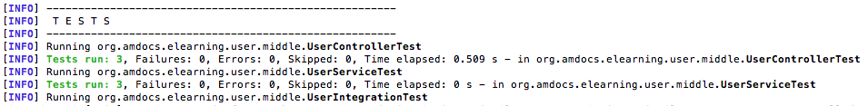
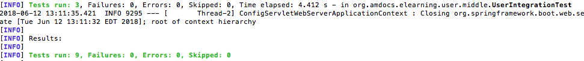

# MD101 - Step 5: Creating new users

In this step, we will get an introduction on what a _POST_ request is, in the context of _REST_. By the end of this lesson,
you will be able to create new users for our service via _HTTP_ and _REST_.

## Introducing HTTP POST for creation

### What is POST?
_POST_ creates new resources. _POST_ must be used to create a new resource in a collection. The _POST_ request's body contains the suggested state representation of the new resource to be added to the server collection.

The _POST_ method is used to invoke the function-oriented controller resources. The _POST_ request may include both 
the headers and a body as inputs to a controller resource's function. When the request is sent to the server, it is intercepted
by the controller. The controller is in charge of curating as well as any transformation that is needed for the data being passed.
In our exercise for the _UserController_ we are going to notice that the _ID_ property is not passes in the body of the _POST_
request, but it is added inside the _createUser_ method.

This behavior can be seen in the following diagram:


HTTP calls the _POST_ request method to be _unsafe_ and _non-idempotent_, which means that its outcome is unpredictable
and not guaranteed to be repeatable without potentially undesirable side effects.


### How does it fit into user-middle?

We will be creating a new endpoint that uses the _POST_ verb to create new Users for our application. When we are done, we should have an endpoint that looks something like this:
```
Request:
HTTP POST /user
{"firstName":"test", "lastName":"name", "middleInitial":"a", "userType":"PATRON", "dateOfBirth":"1-1-1980"}

Response:
201 CREATED
{"id":"2", "firstName":"test", "lastName":"name", "middleInitial":"a", "userType":"PATRON", "dateOfBirth":"1-1-1980"}
```

#### A Few Things to Note
Notice that we did _not_ pass an id field in the request. This is because we want our application to assign users an id, as opposed to the client specifying one on creation. We also passed every field, as none are considered optional. We will be enforcing this by way of request validation as well.


## Implementing POST Into `user-middle`

In order to implement a POST action into user-middle, we need to do several things:
1. Implement a method in our UserService than can create users
2. Create a new POST method in our UserController that can delegate to our UserService class, and respond accordingly.
3. Create unit and integration tests to verify our new functionality


### Test Writing and TDD
Now that we know what we need to implement, this is a great time to begin writing some unit and integration tests, and alter them as we work through the exercise. As mentioned before, this course will not strictly enforce TDD, though it is the recommended approach. If you wish to begin writing tests, we need to cover:

**Unit Tests**
- A test to verify creation of users in our UserService class
- A test to verify the controller functionality, and resulting 201 response code

**Integration Test**
- A test to verify that we can successfully create a user by way of RESTful HTTP, and retrieve it after creation


We encourage you to start trying to write tests now as a means of verifying that the code you produce is doing what it should do. Regardless of when you choose to write tests, there are samples of these tests at the end of this step.


### Modifying the UserService

First, we need to implement a method that can create Users in our UserService. It must do the following:
1. Accept all the details of a User needed for creation as parameters
2. Generate a unique id to assign to the new user
3. Create the new user, and return it

This offers a unique challenge due to how our User object is currently implemented. It is immutable, and offers no setters for setting an ID. In order to get around this, we decided to separate UserDetails from User. Our code looks like:

UserDetails.java
```
public class UserDetails {

    protected String firstName;
    protected String lastName;
    protected String middleInitial;
    protected UserType userType;
    protected LocalDate dateOfBirth;

    public UserDetails() {
    }
    
    

    public UserDetails(@NotNull String firstName, @NotNull String lastName, @NotNull String middleInitial,
            @NotNull UserType userType, @NotNull LocalDate dateOfBirth) {
        this.firstName = firstName;
        this.lastName = lastName;
        this.middleInitial = middleInitial;
        this.userType = userType;
        this.dateOfBirth = dateOfBirth;
    }

    public String getFirstName() {
        return firstName;
    }

    public String getLastName() {
        return lastName;
    }

    public String getMiddleInitial() {
        return middleInitial;
    }

    public UserType getUserType() {
        return userType;
    }

    public LocalDate getDateOfBirth() {
        return dateOfBirth;
    }

}
```

User.java
```
package org.amdocs.elearning.user.middle.user;

import java.time.LocalDate;

public class User extends UserDetails {

    private String id;
    
    public User(){

    }
    
    public User(final String id, final UserDetails details){
        this.id = id;
        this.firstName = details.getFirstName();
        this.lastName = details.getLastName();
        this.middleInitial = details.getMiddleInitial();
        this.userType = details.getUserType();
        this.dateOfBirth = details.getDateOfBirth();
    }

    public User(String id, String firstName, String lastName, String middleInitial, UserType userType, LocalDate dateOfBirth) {
        this.id = id;
        this.firstName = firstName;
        this.lastName = lastName;
        this.middleInitial = middleInitial;
        this.userType = userType;
        this.dateOfBirth = dateOfBirth;
    }

    public String getId() {
        return id;
    }
}
```

UserService.java -> createUser
```
    public User createUser(final UserDetails userDetails){
        final int newUserId = users.size();
        final User newUser = new User(String.valueOf(newUserId), userDetails);
        users.add(newUser);
        return newUser;
    }
```

#### What's going on here?
As with anything in programming, there's many ways to do this. What we did was split our User object into two objects to logically separate a user's details from the user record that contains the id. We then have our service method accept only the user details, and return a full fledged User with an Id as it's output. Now we can wire this up to our controller.


### Modifying the UserController

In order to handle the _POST_ request. Our controller should:
1. Implement a new mehtod marked with the `RequestMethod.POST` request mapping
2. Accept a `UserDetails` object
3. Delegate to the UserService's create method
4. Return an HTTP 201(CREATED) with the created user on success


Your code should look something like this:

```
@RestController
@RequestMapping("/user")
public class UserController {
    private final UserService userService;

    @Autowired
    public UserController(final UserService userService){
        this.userService = userService;
    }
    
    @RequestMapping(method=RequestMethod.POST)
    public ResponseEntity<User> createUser(@RequestBody final UserDetails user){
        final User createdUser = this.userService.createUser(user);
        
        return new ResponseEntity<User>(createdUser, HttpStatus.CREATED);
    }
}
```

#### What's going on here?
- We use `@RequestMapping` and `RequestMethod.POST` to tell Spring to map this method to an HTTP POST to /user
- We use `@RequestBody` to tell Spring that we want to accept a request body that's represented by the UserDetails object. We're going to be sending JSON, and the serialization/deserialization is handled automatically by way of Spring and Jackson.
- We accept the UserDetails object, and delegate to User service to create the user
- We return an HTTP 201 on success. HTTP 201 signifies that an entity was created. We also return the newly created user as JSON


One very important thing to notice is that, our controller is only acting as a broker. It only creates the interaction between the data that 
is being passed in, and the business logic (in this case the _UserService_).


### Building and Running
It's time to restart our server and see what we have built. From the terminal, re-run `mvn clean package` followed by `java -jar target/*.jar`. But how will we actually access our endpoint? We can't exactly use the browser as we could with a regular GET request without a fair amount of work and integration. For this exercise, we are going to use `cURL` - a command line utility for making HTTP requests. In a terminal window, once your server is running, run the following command:
```
curl -v -X POST "http://localhost:8080/user" -H "Content-Type: application/json" -d '{"firstName":"test", "lastName":"name", "middleInitial":"a", "userType":"PATRON", "dateOfBirth":"1980-01-01"}'
```

Your output should look something like:
```
curl -v -X POST "http://localhost:8080/user" -H "Content-Type: application/json" -d '{"firstName":"test", "lastName":"name", "middleInitial":"a", "userType":"PATRON", "dateOfBirth":"1980-01-01"}'
*   Trying 127.0.0.1...
* Connected to localhost (127.0.0.1) port 8080 (#0)
> POST /user HTTP/1.1
> Host: localhost:8080
> User-Agent: curl/7.43.0
> Accept: */*
> Content-Type: application/json
> Content-Length: 109
>
* upload completely sent off: 109 out of 109 bytes
< HTTP/1.1 201
< Content-Type: application/json;charset=UTF-8
< Transfer-Encoding: chunked
< Date: Thu, 14 Jun 2018 16:20:26 GMT
<
* Connection #0 to host localhost left intact
{"firstName":"test","lastName":"name","middleInitial":"a","userType":"PATRON","dateOfBirth":"1980-01-01","id":"2"}
```

Now, we should be able to call an HTTP GET on /user/2 and get our user back. In cURL, this looks like:
```
curl -v "http://localhost:8080/user/2"
*   Trying 127.0.0.1...
* Connected to localhost (127.0.0.1) port 8080 (#0)
> GET /user/2 HTTP/1.1
> Host: localhost:8080
> User-Agent: curl/7.43.0
> Accept: */*
>
< HTTP/1.1 200
< Content-Type: application/json;charset=UTF-8
< Transfer-Encoding: chunked
< Date: Thu, 14 Jun 2018 16:25:24 GMT
<
* Connection #0 to host localhost left intact
{"firstName":"test","lastName":"name","middleInitial":"a","userType":"PATRON","dateOfBirth":"1980-01-01","id":"2"}
```


## Validating our request
We can now create new users, but we still have ne issue. We should make sure consumers pass "good" data. In our case, this means no fields are left out. To do this, we will be utilizing Java Bean Validation.

Let's do the following:
1. Add `javax.validation.constraints.NotNull` annotations to every field in the `UserDetails` class
2. Add the `javax.validation.Valid` annotation to our POST method's `@ReqeustBody`

Your code should looks something like this:

UserDetails fields:
```
    @NotNull
    protected String firstName;
    @NotNull
    protected String lastName;
    @NotNull
    protected String middleInitial;
    @NotNull
    protected UserType userType;
    @NotNull
    protected LocalDate dateOfBirth;

```

UserController create method:
```
    @RequestMapping(method=RequestMethod.POST)
    public ResponseEntity<User> createUser(@RequestBody @Valid final UserDetails user){

        final User createdUser = this.userService.createUser(user);
        return new ResponseEntity<User>(createdUser, HttpStatus.CREATED);
    }
```

Now, let's rebuild and restart our server, and try the following cURL command:

```
curl -v -X POST "http://localhost:8080/user" -H "Content-Type: application/json" -d '{"lastName":"name", "middleInitial":"a", "userType":"PATRON", "dateOfBirth":"1980-01-01"}'
*   Trying 127.0.0.1...
* Connected to localhost (127.0.0.1) port 8080 (#0)
> POST /user HTTP/1.1
> Host: localhost:8080
> User-Agent: curl/7.43.0
> Accept: */*
> Content-Type: application/json
> Content-Length: 89
>
* upload completely sent off: 89 out of 89 bytes
< HTTP/1.1 400
< Content-Type: application/json;charset=UTF-8
< Transfer-Encoding: chunked
< Date: Thu, 14 Jun 2018 16:30:24 GMT
< Connection: close
<
* Closing connection 0
{"timestamp":"2018-06-14T16:30:24.847+0000","status":400,"error":"Bad Request","errors":[{"codes":["NotNull.userDetails.firstName","NotNull.firstName","NotNull.java.lang.String","NotNull"],"arguments":[{"codes":["userDetails.firstName","firstName"],"arguments":null,"defaultMessage":"firstName","code":"firstName"}],"defaultMessage":"must not be null","objectName":"userDetails","field":"firstName","rejectedValue":null,"bindingFailure":false,"code":"NotNull"}],"message":"Validation failed for object='userDetails'. Error count: 1","path":"/user"}
```

### What just happened?
Spring provides and implementation for the [JSR 303 spec](http://beanvalidation.org/1.0/spec/), which allows us to utilize the javax.validation annotations. By marking our fields with `@NotNull` and telling our request handler to use `@Valid`, we are saying that our `UserDetails` POJO *must* have no null fields. When we requested our resource with a missing firstName field, it resulted in an exception, which automatically mapped to an HTTP 400 (Bad Request).


## Tests
In previous chapters we got an introduction to unit and integration testing for our Spring application. In order to test our _POST_ action, 
we are going to use the same dependencies and frameworks (_SpringBootTest, Mockito, JUnit_), if you are not familiar with the basic usage of those, please take a look at _step_4_.

In our previous exercise we implemented a test to validate a _GET_ action against our controller. We will now implement unit and integration test for our _POST_ action.

The next step is to go ahead and write the unit test for the _POST_ action. This should be done inside our _UserControllerTest_ as well.
The expected behavior should be as follows:
* When given a valid user:
    * The controller should return a `201` status code.
    * The controller should return a response body similar to the user that was passed in, but adding an `id` property.

_UserControllerTest_
```
public class UserControllerTest {
    UserService userService = Mockito.mock(UserService.class);
    final UserController controller = new UserController(userService);
    
    @Test
    public void createUser(){
        final User createRequestUser = new User(null, "test", "test", "t", UserType.PATRON, LocalDate.now());
        final User createdUser = new User("1", "test", "test", "t", UserType.PATRON, LocalDate.now());

        Mockito.when(userService.createUser(Mockito.any())).thenReturn(createdUser);
        final ResponseEntity<User> responseEntity = this.controller.createUser(createRequestUser);

        Assert.assertEquals(201, responseEntity.getStatusCodeValue());
        Assert.assertEquals(createdUser, responseEntity.getBody());
    }
    
}
```

_UserServiceTest_

```
public class UserServiceTest {
    final UserService userService = new UserService();

    @Test
    public void testCreateUser(){
        final UserDetails newUser = new UserDetails("new first", "new last", "M", UserType.PATRON, LocalDate.now());
        final User createdUser = userService.createUser(newUser);
        final Optional<User> retrievedUser = userService.getUserById(createdUser.getId());

        Assert.assertTrue(retrievedUser.isPresent());
        Assert.assertEquals(createdUser, retrievedUser.get());
    }
}
```

_UserIntegrationTest_
```
public class UserIntegrationTest {
    @LocalServerPort
    private int port;
    
    @Autowired
    private TestRestTemplate restTemplate;
    
    @Test
    public void createUser() throws Exception {
        final UserDetails user = new User(null, "firstName", "lastName", "M", UserType.PATRON, LocalDate.now());
        final ResponseEntity<User> responseEntity = this.restTemplate.postForEntity("http://localhost:" + port + "/user", user, User.class);
    
        Assert.assertEquals(201, responseEntity.getStatusCodeValue());
        Assert.assertNotNull(responseEntity.getBody()); 
    }
}
```

## Building and running
First, we have to re-package our application by running `mvn clean verify` in our home directory (_`user-middle/`_).
At this point, if we go through the logs, we should see something similar to:

_Passing Tests_




_Successful Build_


## Summary
On this step, you walked through the process on how to create new users via HTTP POST. You were able to see the flow of the 
HTTP request, implement unit and integration tests, and successfully run our application.

Up to this point we are able to create new users as well as retrieve existing users from our service. In the next step you will
learn how to update existing users.

When you are ready, `git checkout step_6`